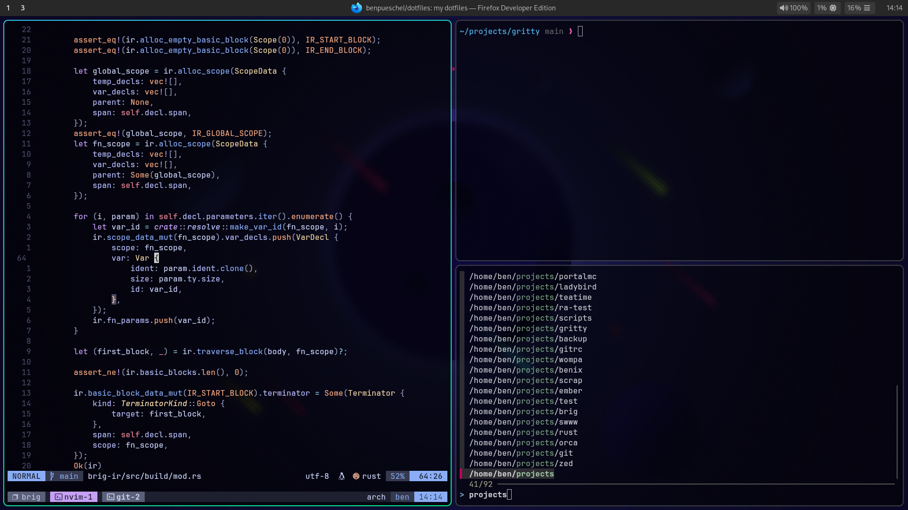

# my dotfiles

My personal dotfiles.



## Prerequisites

You need to make sure the following software is installed for the dotfiles to work properly:
- [GNU Stow](https://www.gnu.org/software/stow/)
- [neovim](https://neovim.io)
- [zsh](https://www.zsh.org)
- [fzf](https://github.com/junegunn/fzf)
- [tmux](https://github.com/tmux/tmux)
- [git](https://git-scm.com)
- [ripgrep](https://github.com/BurntSushi/ripgrep)

The dotfiles also come with a [Hyprland](https://https://hyprland.org/) configuration, so you might want to install that as well.

### Arch Linux
```sh
sudo pacman -S stow neovim zsh fzf tmux git ripgrep
```
To install Hyprland, you can use the AUR package `hyprland-git`.
I recommend using an AUR helper like `yay`:
```sh
pacman -S --needed git base-devel
git clone https://aur.archlinux.org/yay.git
cd yay
makepkg -si
```
Then, install `hyprland-git`:
```sh
yay -S hyprland-git
```
You'll also need `waybar`, which is available in the official repositories:
```sh
sudo pacman -S waybar
```

### Ubuntu
```sh
sudo apt install stow neovim zsh fzf tmux git ripgrep
```
First of all, my condolences for wanting to install Hyprland on Ubuntu.
You'll need to manually build Hyprland from source, but there's a [guide on the Hyprland wiki](https://wiki.hyprland.org/Getting-Started/Installation/).

Waybar has a PPA, so you can install it like this:
```sh
sudo add-apt-repository ppa:nschloe/waybar && sudo apt update
sudo apt install waybar
```

### NixOS
Add the following packages to your `configuration.nix`:
```nix
environment.systemPackages = with pkgs; [
  stow
  neovim
  zsh
  fzf
  tmux
  git
  ripgrep
];
programs.zsh.enable = true;
```

To enable Hyprland and install waybar, add the following to your `configuration.nix`:
```nix
programs.hyprland.enable = true;
environment.systemPackages = with pkgs; [
  waybar
];
```

### MacOS
Ensure [Homebrew](https://brew.sh) is installed.
zsh is already installed on MacOS, so you only need to install the other dependencies:
```sh
brew install stow neovim fzf tmux git ripgrep
```

## Installation

Make sure you have the [prerequisites](#prerequisites) installed and change your cwd to `$HOME`:
```sh
cd $HOME
```

Then, clone the repository:
```sh
git clone https://github.com/benpueschel/dotfiles.git && cd dotfiles
```

Now, you can use GNU Stow to symlink the dotfiles you want to use:
```sh
stow -S alacritty git hyprland nvim scripts ssh tmux zsh
```
This will symlink all dotfiles to the parent directory (which is `$HOME`
because we cloned the repo into `$HOME/dotfiles`).

If you want to put the dotfiles in a different directory, you can use stow like this:
```sh
stow -S alacritty git hyprland nvim scripts ssh tmux zsh -t $HOME
```
The `-t` flag specifies the target directory, which ***must*** always be `$HOME`.

Now you can change your default shell to zsh and restart your shell:
```sh
chsh -s $(which zsh)
exec zsh
```

Aaand you're good to go! 🚀
